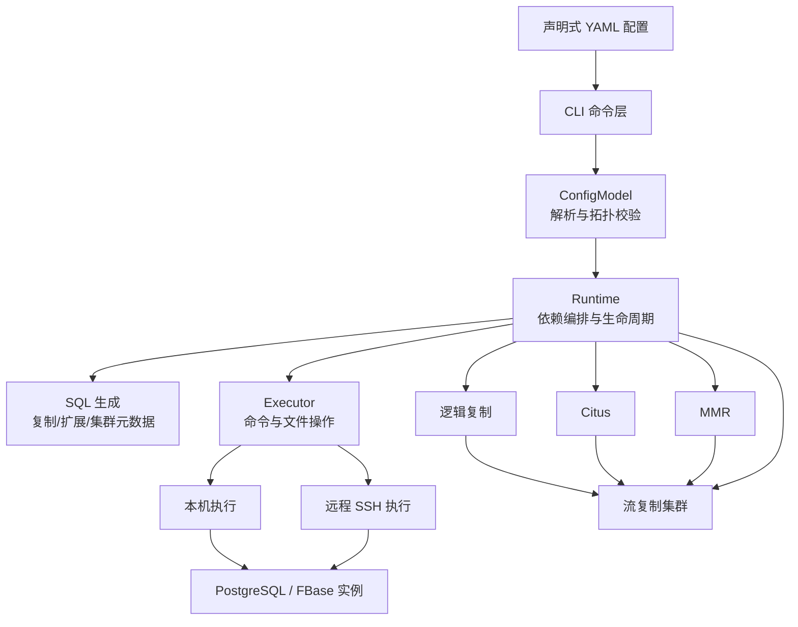

# pgcluster

`pgcluster` 是一个面向 PostgreSQL 和 FBase 的声明式集群部署工具。它用一份 YAML 描述主机、数据库安装、实例、复制关系和集群拓扑，再通过命令行完成校验、创建、启停、检查、清理和故障切换。

它适合需要重复部署或维护多套 PostgreSQL/FBase 环境的场景。配置是拓扑的唯一来源，部署命令会根据上层集群的依赖自动创建底层流复制集群。

## 能力范围

- PostgreSQL/FBase 安装、许可证和插件前置条件检查
- 单实例和物理流复制
- `pub`/`sub` 逻辑复制
- Citus Coordinator/Worker 集群
- FBase MMR 多活集群
- 实例健康、复制延迟、拓扑和部署标记检查
- 主备启停、重启、清理、故障切换和旧主库 rejoin
- 本机直连和远程 SSH 执行

## 技术架构



核心模块：

- `pgclusterlib/config.py`：读取 YAML、展开环境变量
- `pgclusterlib/config_model.py`：配置模型、引用校验和拓扑树
- `pgclusterlib/runtime.py`：实例生命周期、复制创建、健康检查和依赖编排
- `pgclusterlib/executor.py`：本机/SSH 命令执行、原子写文件和操作日志
- `pgclusterlib/cli.py`：命令行参数和用户输出
- `pgclusterlib/locking.py`：同一配置的并发操作锁

## 配置文件

正式配置是 [pgcluster.yaml](pgcluster.yaml)，完整示例是 [pgcluster.example.yaml](pgcluster.example.yaml)。

默认配置选择顺序：

1. 当前目录的 `pgcluster.local.yaml`
2. 当前目录的 `pgcluster.yaml`

`pgcluster.local.yaml` 已加入 `.gitignore`，用于保存当前环境的主机地址、目录、许可证和安装路径，不应提交到仓库。也可以用 `-f/--file` 显式指定配置：

```bash
./pgcluster -f /path/to/production.yaml list
```

配置主要由以下部分组成：

- `hosts`：主机地址。本机地址直连，其他地址默认 SSH。
- `postgresql_installations`：PostgreSQL/FBase 安装目录、许可证和插件。
- `instances`：实例名、主机、端口和 PGDATA。
- `streaming_clusters`：物理流复制集群。
- `logical_replications`：逻辑复制的 publisher/subscriber。
- `citus_clusters`：Coordinator 和 Worker 引用的流复制集群。
- `mmr_clusters`：MMR 成员引用的流复制集群。

## 常用用法

查看配置和帮助：

```bash
./pgcluster list
./pgcluster graph mmr.mmr_cluster
./pgcluster help
./pgcluster help create
./pgcluster tui
./pgcluster tui logical.pub_sub
```

校验和前置条件：

```bash
./pgcluster validate logical.pub_sub
./pgcluster doctor
./pgcluster install fbase15
./pgcluster install postgresql17 --force
```

创建顶层集群：

```bash
./pgcluster create streaming.basic_cluster
./pgcluster create logical.pub_sub
./pgcluster create citus.citus_cluster
./pgcluster create mmr.mmr_cluster
```

创建逻辑复制、Citus 或 MMR 时，工具会先创建其依赖的流复制集群，再创建上层复制或集群元数据。
创建命令会实时输出阶段进度，例如主库初始化、备库配置、实例就绪和上层元数据创建；每条底层命令和
SQL 不会直接刷到终端。

生命周期和检查：

```bash
./pgcluster status streaming.basic_cluster
./pgcluster health mmr.mmr_cluster
./pgcluster lag streaming.basic_cluster
./pgcluster verify logical.pub_sub
./pgcluster start streaming.basic_cluster
./pgcluster stop streaming.basic_cluster
./pgcluster restart streaming.basic_cluster
./pgcluster monitor streaming.basic_cluster --once
```

危险操作需要显式确认：

```bash
./pgcluster clean streaming.basic_cluster --yes
./pgcluster delete streaming.basic_cluster --yes
./pgcluster failover streaming.basic_cluster --yes
./pgcluster rejoin streaming.basic_cluster --yes
```

`clean` 和 `delete` 只操作带 `.pgcluster-managed` 标记的数据目录；清理前会删除目标拓扑的复制元数据。所有修改型操作使用配置锁，避免同一环境并发变更。
`install`、`start`、`stop`、`restart`、`clean`、`failover` 和 `rejoin` 会输出关键阶段进度；查询类命令保持结果导向的简洁输出。
`status` 使用与 `list` 一致的树状拓扑，显示每个实例的运行状态；无法探测的实例标记为 `未知`，原因显示在树后。
`tui` 是实时部署关系图，默认每 3 秒刷新一次。每个 PostgreSQL 实例独立显示为一个节点，包含
实例地址、主进程 PID、完整 PGDATA 和运行状态；图中同时显示流复制、逻辑复制、Citus 和 MMR 关系。
节点组上方显示连接数、TPS（每秒事务数）、缓存命中率，以及对应复制类型的延迟或订阅状态。
按 `q` 或 `Ctrl-C` 退出。使用 `--once` 可只渲染一帧，使用 `--refresh 5` 可调整刷新间隔。
可追加一个集群目标只监控该拓扑，例如 `./pgcluster tui logical.pub_sub`。
在界面中按 `c` 可将当前筛选后的纯文本部署图复制到系统剪贴板，按 `r` 立即刷新，按 `q` 退出。

全屏 TUI 使用可选的 Textual 依赖，安装后启动：

```bash
sudo apt install python3-venv       # Debian/Ubuntu 首次使用时
python3 -m venv .venv
. .venv/bin/activate
python -m pip install -e '.[tui]'
./pgcluster tui
```

无法安装额外依赖的服务器可以使用 `./pgcluster tui --text`。

## 文档

- [README.md](README.md)：项目定位、架构、配置和用户操作
- [pgcluster.example.yaml](pgcluster.example.yaml)：可复制修改的完整配置示例
- [docs/PROGRESS.md](docs/PROGRESS.md)：开发进度、已完成能力和已知限制
- [docs/superpowers/specs/2026-07-28-pg-cluster-deployment-config-cli-design.md](docs/superpowers/specs/2026-07-28-pg-cluster-deployment-config-cli-design.md)：配置与 CLI 设计记录
- `tests/`：配置、执行器和运行时单元测试

## 测试

```bash
python3 -m unittest discover -s tests -v
```

当前已知限制：没有常驻自动故障检测守护进程；Citus 没有配置 `source_dir`，缺少 Citus 时会报告前置条件不足而不会自动编译。
