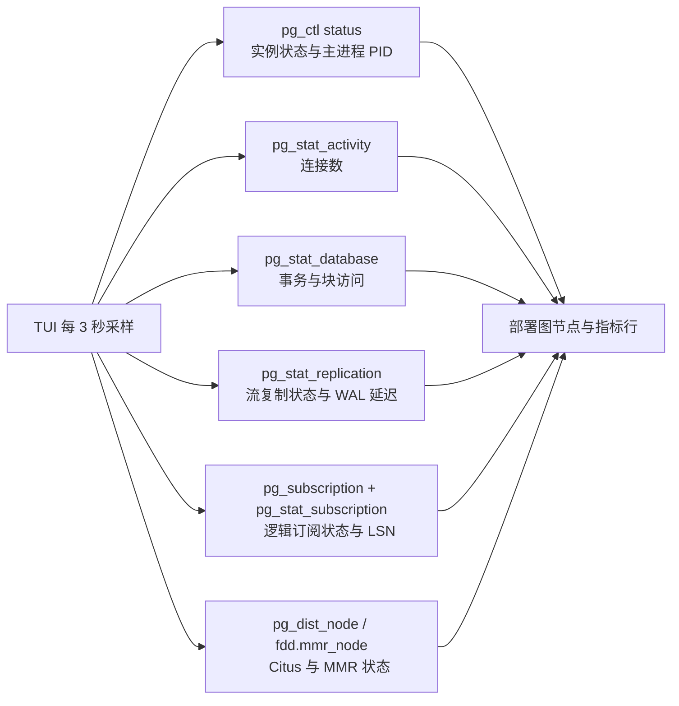

# pgcluster 监控指标说明

本文说明 `./pgcluster tui` 中指标的来源、计算方式和使用边界。TUI 只读取 PostgreSQL/FBase 的统计视图，不会修改数据库统计数据。

## 1. 采样流程



默认刷新间隔为 3 秒，可用 `--refresh 5` 调整。指定目标时，只采样该目标及其依赖的实例：

```bash
./pgcluster tui logical.pub_sub
./pgcluster tui streaming.basic_cluster
```

## 2. 顶部指标行

每个目标关系框上方显示一行指标。例如：

```text
指标 连接=2/100 | TPS=2.0 次/秒 | 缓存命中=100.0% | 订阅=停用 | 最新LSN=0/3057720
```

### 2.1 连接数

显示格式：

```text
连接=当前客户端连接数/max_connections
```

数据来源：

```sql
SELECT count(*)
FROM pg_stat_activity
WHERE backend_type = 'client backend';

SELECT setting
FROM pg_settings
WHERE name = 'max_connections';
```

`2/100` 表示当前有 2 个客户端连接，实例允许的最大连接数为 100。后台进程、WAL sender 等非 `client backend` 不计入分子。

多个运行中的主库会分别采样，TUI 显示连接数合计；最大连接数显示这些主库配置中的最大值，因此它不是严格意义上的全局连接池容量。

### 2.2 TPS

TPS 是 Transactions Per Second，即每秒事务数。数据库统计视图保存的是累计值，TUI 用两次采样的差值计算：

```text
事务累计值 = xact_commit + xact_rollback
TPS = (本次事务累计值 - 上次事务累计值) / 两次采样实际间隔秒数
```

数据来源：

```sql
SELECT COALESCE(sum(xact_commit + xact_rollback), 0)
FROM pg_stat_database
WHERE datname NOT IN ('template0', 'template1');
```

示例：

```text
第一次采样：10000
第二次采样：10600
间隔：3 秒
TPS = (10600 - 10000) / 3 = 200.0 次/秒
```

注意：

- 第一次采样没有前一个值，因此显示 `0.0`。
- PostgreSQL 重启或统计信息重置后累计值可能变小，TUI 会把负差值按 0 处理。
- 这是提交和回滚的事务吞吐量，不是 QPS，也不等于 SQL 语句数。

### 2.3 共享缓存命中率

共享缓存命中率回答的是：“访问数据库块时，有多少比例直接从 PostgreSQL 的缓冲区命中，而不需要读取磁盘块？”

数据来源：`pg_stat_database` 的 `blks_hit` 和 `blks_read`。

```sql
SELECT
  100.0 * sum(blks_hit)
  / NULLIF(sum(blks_hit + blks_read), 0)
FROM pg_stat_database;
```

公式：

```text
缓存命中率 = blks_hit / (blks_hit + blks_read) × 100%
```

图示：

```text
一次数据块访问
       │
       ├── 命中 shared_buffers  ──> blks_hit
       │
       └── 未命中，需要读取块  ──> blks_read

命中率 = 命中次数 / (命中次数 + 读取次数)
```

例子：

```text
blks_hit  = 950000
blks_read =  50000
命中率 = 950000 / 1000000 × 100% = 95.0%
```

当前实现对每个运行中的主库计算一次，再取主库命中率的算术平均：

```text
TUI 命中率 = (主库 A 命中率 + 主库 B 命中率 + ...) / 运行主库数
```

这不是以下指标：

- 不是 shared_buffers 使用百分比；
- 不是操作系统 page cache 命中率；
- 不是磁盘利用率；
- 不是单条 SQL 的命中率。

命中率在数据库刚启动、访问量很低或统计信息刚重置时参考价值有限。通常应结合磁盘延迟、查询耗时和工作集大小判断，不能只看一个百分比。

### 2.4 TPS、连接数和缓存命中率的关系


不能简单地认为“连接越多 TPS 越高”或“命中率 100% 就没有性能问题”。连接数反映并发，TPS 反映事务吞吐，命中率反映块访问路径，三者需要结合观察。

## 3. 流复制指标

流复制节点框内的箭头：

```text
Primary ── PHYSICAL ──▶ Standby
```

### 3.1 streaming 备库数

数据来源：主库的 `pg_stat_replication`。

```sql
SELECT count(*)
FROM pg_stat_replication
WHERE state = 'streaming';
```

TUI 将实际数量与 YAML 中配置的 standby 数量对比：

```text
流复制=实际 streaming 备库数 / 配置的 standby 数
```

例如 `流复制=1/1` 表示配置了一个备库，并且当前有一个备库处于 streaming 状态。`0/1` 表示备库没有进入 streaming。

### 3.2 WAL 延迟

数据来源：主库的 `pg_stat_replication.replay_lsn` 和当前 WAL LSN。

```sql
SELECT COALESCE(
         max(pg_wal_lsn_diff(pg_current_wal_lsn(), replay_lsn)),
         0
       )
FROM pg_stat_replication
WHERE state = 'streaming';
```

公式：

```text
WAL 延迟（字节） = 主库当前 WAL LSN - 备库 replay_lsn
```

这是 WAL 字节距离，不是时间延迟。`0 B` 表示 LSN 基本追平；数值持续增大表示备库回放速度落后于主库写入速度。TUI 在多个备库时显示最大值。

## 4. 逻辑复制指标

逻辑复制关系为：

```text
Publisher Primary ── LOGICAL REPLICATION ──▶ Subscriber Primary
```

### 4.1 订阅状态

数据来源：

```sql
SELECT
  subenabled,
  latest_end_lsn
FROM pg_subscription s
LEFT JOIN pg_stat_subscription g USING (subname)
WHERE s.subname = '<name>_sub';
```

`订阅=启用` 表示 `subenabled=true`；`订阅=停用` 表示订阅存在但被禁用；`订阅=缺失` 表示找不到对应订阅对象。

### 4.2 最新 LSN

`最新LSN` 是 `pg_stat_subscription.latest_end_lsn`，表示订阅端最近完成处理的远端 WAL 位置，例如：

```text
最新LSN=0/3057720
```

LSN 本身不是字节延迟。要得到严格的逻辑复制延迟，需要将 Publisher 当前 WAL LSN 与 Subscriber 的最新 LSN 做差；当前 TUI 先展示状态和位置，避免在不同数据库/连接异常时给出误导性的延迟值。

## 5. Citus 和 MMR 指标

### 5.1 Citus Worker

数据来源：Coordinator 的 `pg_dist_node`。

```sql
SELECT
  count(*) AS total,
  count(*) FILTER (WHERE isactive) AS active
FROM pg_dist_node
WHERE groupid > 0;
```

TUI 显示：

```text
Worker=活跃数/总数 active
```

Coordinator 不计入 Worker 数量。Worker 进程本身仍会在部署图中以独立主备数据库节点显示。

### 5.2 MMR 活跃成员

数据来源：每个 MMR 成员的 `fdd.mmr_node`。

```sql
SELECT count(*)
FROM fdd.mmr_node
WHERE node_state = 'ACTIVE';
```

TUI 按成员列出活跃节点数量。MMR 的具体复制冲突、队列堆积和同步延迟需要 FBase MMR 扩展提供更细的统计视图，当前版本不虚构这些指标。

## 6. 实例状态、PID 和 PGDATA

### 实例状态

TUI 调用对应安装目录下的：

```bash
pg_ctl status -D <PGDATA>
```

并从输出中提取 PostgreSQL postmaster 主进程 PID。PostgreSQL 是多进程架构，TUI 只显示主进程 PID，不列出每个 backend、WAL sender 或后台 worker 的 PID。

### PGDATA

PGDATA 来自 YAML 中对应实例的 `data_dir`。为了保持节点框宽度，TUI 在目录分隔符处分行，例如：

```text
PGDATA /home/postgres/pgcluster/data/
       logical/publisher/primary
```

这是同一个完整路径，并不是省略号。按 `c` 复制拓扑时也会复制完整两行。

## 7. 指标为空或显示“未知”

出现 `未知` 通常有以下原因：

1. 实例没有运行，无法连接 PostgreSQL；
2. 主机通过 SSH 不可达；
3. 对应扩展或统计视图不存在；
4. 数据库刚启动，统计累计值还没有样本；
5. 订阅对象尚未创建或还没有收到 WAL。

TUI 不会把无法采集的数据伪装成 0。`0` 表示查询确实返回了 0，`未知` 表示没有得到可靠结果。

## 8. 相关命令

```bash
# 全部配置拓扑
./pgcluster tui

# 只监控逻辑复制及其两组流复制实例
./pgcluster tui logical.pub_sub

# 无全屏依赖的文本采样
./pgcluster tui --text logical.pub_sub

# 复制当前拓扑纯文本
# 启动 TUI 后按 c
```

